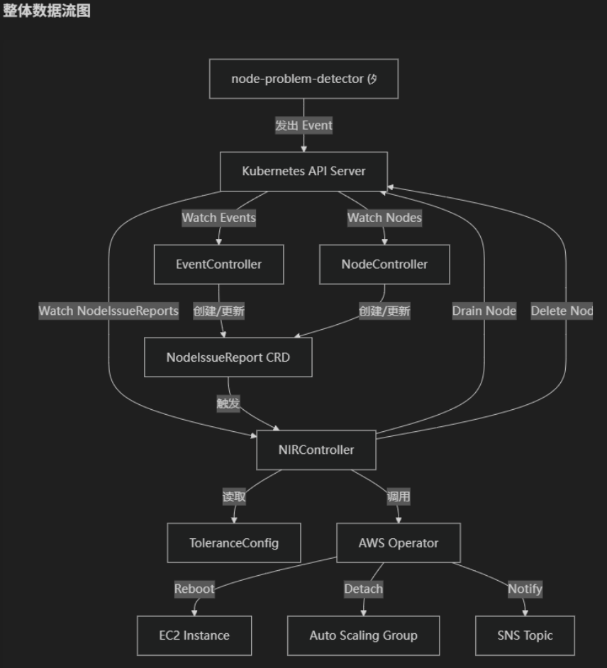
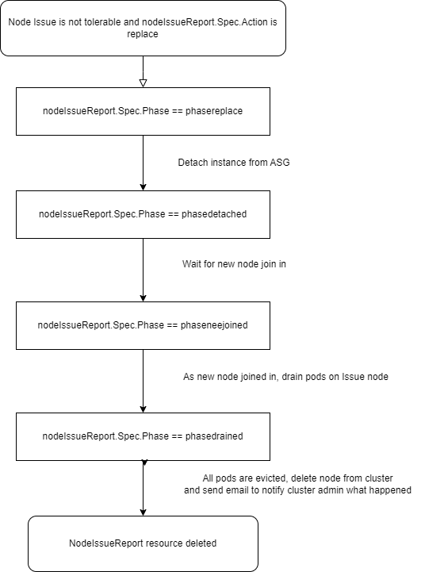
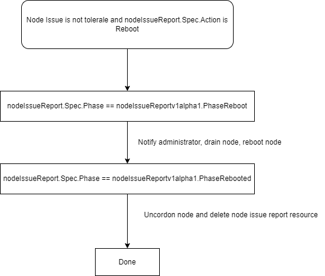

# npd-node-replace v2

## 简介

npd-node-replace 是一个面向 Amazon EKS 中国区集群的节点自动修复组件，用于解决问题节点无法被及时处理的痛点。

组件基于 [node-problem-detector (NPD)](https://github.com/kubernetes/node-problem-detector) 上报的节点异常事件，通过积分桶（Score Bucket）机制评估节点健康状况，自动执行 reboot、replace 或 paging（仅通知）操作，并支持 escalation（升级操作）策略。

代码结构详解：https://deepwiki.com/normalzzz/npd-node-replace

## v2 版本主要变更

相比 v1 版本，v2 进行了以下重大改进：

1. **ToleranceConfig 自定义资源**：容忍策略从 ConfigMap（JSON 文件）升级为 Kubernetes 自定义资源（Cluster scope），支持热更新，无需重启组件
2. **积分桶机制**：从简单的"N 次触发"改为基于分数的积分桶模型，不同事件类型可配置不同权重分数，更灵活地评估节点健康状况
3. **按节点类型差异化策略**：通过 node label 匹配，为不同类型的节点（GPU 节点、通用计算节点、监控节点等）配置不同的容忍策略
4. **Escalation 机制**：首次触发 action（如 reboot）后，在 cooldown 窗口内如果积分桶再次打满，自动升级为更强的操作（如 replace 或 paging）
5. **事件时间窗口**：通过 `eventWindowInMinutes` 配置滑动时间窗口，只统计窗口内的事件分数，过期事件自动失效
6. **节点类型过滤**：自动过滤 Karpenter 管理的节点和 Fargate 节点，仅处理 ASG 托管节点组中的节点
7. **NIR 生命周期管理**：reboot/paging 完成后保留 NodeIssueReport 资源用于 escalation 评估，cooldown 过期后自动清理
8. **Reboot 安全等待**：reboot 操作后等待节点真正完成重启并恢复 Ready 状态，再 uncordon 节点，避免 pod 出现 ContainerStatusUnknown
9. **SNS 通知优化**：不同场景（reboot、replace、paging、escalation、cooldown 过期等）发送不同主题的通知邮件
10. **Leader Election**：支持多副本部署，通过 Lease 实现 leader election，保证同一时间只有一个实例执行操作

## 核心功能

1. 侦听来自 NPD 的节点问题事件（OOMKilling、KernelOops、ReadonlyFilesystem、NTPProblem 等）
2. 将事件记录在 NodeIssueReport 自定义资源中，并基于 ToleranceConfig 配置的积分桶进行分数累加
3. 积分桶打满时，根据配置执行 reboot、replace 或 paging 操作
4. 支持 escalation：首次操作后 cooldown 窗口内再次打满积分桶，自动升级操作
5. 监控节点状态，NotReady/Unknown 状态持续超过 grace time 后执行节点替换
6. 通过 SNS 通知管理员节点问题和操作结果

## 重要（使用之前请重点阅读）

- 组件仅处理 EKS 托管节点组（ASG 管理）中的节点，自动过滤 Karpenter 和 Fargate 节点
- 本组件属于个人项目，不属于 Amazon Web Services，遇到问题请提交 [Issue](https://github.com/normalzzz/npd-node-replace/issues)
- 请将组件部署在 Fargate 计算资源上，参考[如何在 EKS 使用 Fargate](https://docs.amazonaws.cn/eks/latest/userguide/fargate-getting-started.html)
- reboot 和 replace 操作前会执行节点 drain，请注意集群中的 [PDB 配置](https://kubernetes.io/docs/tasks/run-application/configure-pdb/)
- 对于不希望被自动操作的节点，在 ToleranceConfig 中设置 `allowOperation: false` 即可仅通知不操作
- 节点 Reboot 期间 kubelet 无法汇报状态，节点可能转为 NotReady，请通过 `NODE_DOULBE_CHECK_GRACE_TIME` 环境变量调整 double check 的等待时间（单位：分钟），确保大于节点重启所需时间

```yaml
- name: NODE_DOULBE_CHECK_GRACE_TIME
  value: "5"   # double check 等待时间，单位分钟，默认 3 分钟
```

## 整体架构



## 自定义资源

### ToleranceConfig（Cluster scope）

ToleranceConfig 是集群级别的自定义资源，用于定义不同类型节点的容忍策略。通过 node label 匹配节点，为每种节点类型配置独立的积分桶参数、操作类型和 escalation 策略。

字段说明：

| 字段 | 类型 | 必填 | 说明 |
|------|------|------|------|
| `nodeLabel` | string | 是 | 节点标签选择器，格式 `key=value`，用于匹配目标节点 |
| `bucketSize` | int32 | 是 | 积分桶容量，累计分数达到此值时触发操作 |
| `action` | string | 是 | 积分桶打满时执行的操作：`reboot`、`replace` 或 `paging` |
| `allowOperation` | bool | 是 | 是否允许执行操作，`false` 则仅发送 SNS 通知 |
| `eventWindowInMinutes` | int32 | 是 | 事件滑动时间窗口（分钟），仅统计窗口内的事件分数 |
| `cooldownTimeInMinutes` | int32 | 否 | 操作后的冷却窗口（分钟），窗口内再次打满积分桶则触发 escalation |
| `escalateOperation` | string | 否 | Escalation 操作：`replace` 或 `paging` |
| `eventScores` | array | 是 | 事件分数配置列表 |
| `eventScores[].eventName` | string | 是 | NPD 事件名称（如 `OOMKilling`、`KernelOops`） |
| `eventScores[].score` | int32 | 是 | 该事件类型的分数权重 |

示例配置：

```yaml
apiVersion: nodeissuereporter.xingzhan.io/v1alpha1
kind: ToleranceConfig
metadata:
  name: cluster-tolerance-policy
spec:
  configs:
    # GPU 节点：积分桶 100 分，先 reboot，cooldown 30 分钟内再打满则 replace
    - nodeLabel: "node.kubernetes.io/instance-type=p3.2xlarge"
      bucketSize: 100
      action: reboot
      allowOperation: true
      cooldownTimeInMinutes: 30
      eventWindowInMinutes: 60
      escalateOperation: replace
      eventScores:
        - eventName: OOMKilling
          score: 30
        - eventName: KernelOops
          score: 50
        - eventName: ReadonlyFilesystem
          score: 100
        - eventName: DockerHung
          score: 40

    # 通用计算节点：积分桶 80 分，先 reboot，cooldown 内再打满则仅通知
    - nodeLabel: "eks.amazonaws.com/nodegroup=general-compute"
      bucketSize: 80
      action: reboot
      allowOperation: true
      cooldownTimeInMinutes: 20
      eventWindowInMinutes: 45
      escalateOperation: paging
      eventScores:
        - eventName: OOMKilling
          score: 20
        - eventName: KernelOops
          score: 40
        - eventName: NTPProblem
          score: 15
        - eventName: NetworkUnavailable
          score: 30

    # 监控节点：不允许自动操作，仅通知管理员
    - nodeLabel: "role=monitoring"
      bucketSize: 50
      action: paging
      allowOperation: false
      eventWindowInMinutes: 30
      eventScores:
        - eventName: OOMKilling
          score: 25
        - eventName: KernelOops
          score: 50
```

### NodeIssueReport（Namespaced）

NodeIssueReport 由组件自动创建和管理，记录节点的问题事件和处理状态。用户无需手动创建。

关键字段：
- `scoreInBucket`：当前积分桶中的累计分数
- `lastActionTime`：上次执行操作的时间，用于 escalation 判定和事件计分下界
- `escalated`：是否已触发 escalation
- `phase`：当前处理阶段（PhaseNone → PhaseReboot → PhaseRebooted → PhaseNone，或 PhaseReplace → PhaseDetached → PhaseNewJoined → PhaseDrained）

## 积分桶工作原理

```
NPD 事件 → EventController 记录事件到 NIR → 根据 eventWindow 和 lastActionTime 重新计算分数
                                                          ↓
                                              scoreInBucket >= bucketSize ?
                                                    ↓ 是              ↓ 否
                                          检查是否在 cooldown 内      等待更多事件
                                          ↓ 是              ↓ 否
                                    escalation 操作    正常 action（reboot/replace/paging）
                                                          ↓
                                              设置 lastActionTime，清零 scoreInBucket
                                                          ↓
                                              reboot/paging 完成后重置 NIR 为 PhaseNone
                                              （保留 NIR 等待可能的 escalation）
                                                          ↓
                                              cooldown 过期且无新 action → 清理 NIR
```

## NodeIssueReport 生命周期

### Reboot 流程
1. 积分桶打满 → 设置 Action=reboot, Phase=PhaseReboot
2. drain 节点 → 调用 EC2 RebootInstances API → Phase=PhaseRebooted
3. 等待 2 分钟 grace period（确保 reboot 生效）
4. 等待节点恢复 Ready → uncordon 节点
5. 重置 Phase=PhaseNone, Action=None（保留 NIR 用于 escalation 评估）
6. cooldown 过期后，定时清理任务删除 NIR

### Replace 流程
1. 积分桶打满 → 设置 Action=replace, Phase=PhaseReplace
2. 从 ASG detach 实例 → Phase=PhaseDetached
3. 等待新节点加入并 Ready → Phase=PhaseNewJoined
4. drain 旧节点 → Phase=PhaseDrained
5. 删除旧节点 → 删除 NIR（终态）

### Escalation 流程
1. 首次 action（如 reboot）完成后，NIR 保留，lastActionTime 已记录
2. cooldown 窗口内新事件持续累积，积分桶再次打满
3. 检测到在 cooldown 内 → 标记 Escalated=true，执行 escalateOperation
4. escalation 操作完成后删除 NIR




## Node Controller（节点状态监控）

1. 当节点状态从 Ready 转变为 Unknown 或 NotReady 时，Node Controller 捕获状态变化
2. 使用 delay workqueue 引入 double check 机制：在 grace time（默认 3 分钟，可配置）后再次检查节点状态
3. 如果节点恢复 Ready，消除记录；如果仍为 NotReady/Unknown，执行节点替换
4. 自动过滤 Karpenter 和 Fargate 节点

## 部署

**前置依赖：请先部署 [node-problem-detector](https://github.com/kubernetes/node-problem-detector?tab=readme-ov-file#installation)**

### 镜像构建

```bash
docker build -t npd-node-replace .
```

中国区用户：
```bash
docker build -t npd-node-replace -f ./Dockerfile_cn .
```

### IAM 权限配置

组件需要 EC2、Auto Scaling、SNS 权限，建议通过 [IRSA](https://docs.amazonaws.cn/eks/latest/userguide/iam-roles-for-service-accounts.html) 授权。

最小 IAM 策略：
```json
{
    "Version": "2012-10-17",
    "Statement": [
        {
            "Effect": "Allow",
            "Action": [
                "ec2:RebootInstances",
                "ec2:DescribeInstances",
                "autoscaling:DetachInstances",
                "sns:Publish"
            ],
            "Resource": ["*"]
        }
    ]
}
```

使用 eksctl 创建 IRSA：
```bash
eksctl create iamserviceaccount \
    --cluster=<cluster name> \
    --namespace=<fargate namespace> \
    --name=npd-node-replace-sa \
    --attach-policy-arn=arn:aws-cn:iam::<account id>:policy/NPDNodeReplacePolicy \
    --override-existing-serviceaccounts \
    --region <region> \
    --approve
```

### 部署步骤

1. 部署 CRD：
```bash
kubectl apply -f config/crd/nodeissuereporter.xingzhan.io_nodeissuereports.yaml
kubectl apply -f config/crd/nodeissuereporter.xingzhan.io_toleranceconfigs.yaml
```

2. 部署 RBAC 和组件：
```bash
kubectl apply -f deploy/npd-node-replace-clusterrole.yaml
kubectl apply -f deploy/npd-node-replace-clusterrolebinding.yaml
kubectl apply -f deploy/npd-node-replace-sa.yaml
kubectl apply -f deploy/npd-node-replace-deployment.yaml
```

3. 创建 ToleranceConfig：
```bash
kubectl apply -f examples/toleranceconfig-sample.yaml
```

### Helm 部署

```bash
helm repo add <alias> https://normalzzz.github.io/npd-node-replace/
helm repo update
```

v2 chart 名称为 `npd-node-replace-v2`，与 v1 的 `npd-node-replace` 互不影响。

更新 values.yaml：
```yaml
kubernetesClusterDomain: cluster.local

npdNodeReplace:
  replicas: 2
  image:
    repository: <account id>.dkr.ecr.<region id>.amazonaws.com.cn/<repository name>
    tag: latest
  imagePullPolicy: Always
  env:
    snsTopicArn: <sns topic arn>
    awsRegion: <region id>
    nodeDoubleCheckGraceTime: 5

sa:
  serviceAccount:
    create: false
    annotations:
      eks.amazonaws.com/role-arn: <IRSA IAM role arn>

toleranceConfig:
  create: true
  name: cluster-tolerance-policy
  configs:
    - nodeLabel: "eks.amazonaws.com/nodegroup=your-nodegroup"
      bucketSize: 80
      action: reboot
      allowOperation: true
      cooldownTimeInMinutes: 20
      eventWindowInMinutes: 45
      escalateOperation: paging
      eventScores:
        - eventName: OOMKilling
          score: 20
        - eventName: KernelOops
          score: 40
```

部署：
```bash
helm install <release name> <alias>/npd-node-replace-v2 \
    --namespace <fargate namespace> \
    -f values.yaml
```

如果不希望 Helm 管理 ToleranceConfig 资源（例如需要手动管理多个 ToleranceConfig），设置 `toleranceConfig.create: false`，然后手动 apply：
```bash
kubectl apply -f examples/toleranceconfig-sample.yaml
```

### 环境变量配置

| 环境变量 | 说明 | 默认值 |
|---------|------|--------|
| `SNS_TOPIC_ARN` | SNS Topic ARN，用于发送通知 | 必填 |
| `AWS_REGION` | AWS 区域 | 必填 |
| `NODE_DOULBE_CHECK_GRACE_TIME` | 节点状态 double check 等待时间（分钟） | 3 |
| `SELF_POD_NAME` | 当前 Pod 名称（通过 fieldRef 注入） | - |
| `SELF_POD_NAMESPACE` | 当前 Pod 命名空间（通过 fieldRef 注入） | - |
| `SELF_NODE_NAME` | 当前 Pod 所在节点名称（通过 fieldRef 注入） | - |

## SNS 通知类型

组件在不同场景下发送不同主题的 SNS 通知：

| 场景 | 邮件主题 |
|------|---------|
| 节点被 reboot | `[npd-node-replace] Node REBOOTED due to persistent issues` |
| 节点被 replace | `[npd-node-replace] Node REPLACED due to persistent issues` |
| Paging（仅通知） | `[npd-node-replace] Node issues detected - admin notification (paging)` |
| allowOperation=false | `[npd-node-replace] Node issues detected - auto-action disabled, notify only` |
| Cooldown 过期清理 | `[npd-node-replace] Node issue report cleanup - cooldown expired, no escalation triggered` |
| Escalation paging | `[npd-node-replace] ESCALATION - repeated issues after action, admin notification` |

## 测试

模拟 OOMKilling 事件（在目标节点上执行）：
```bash
echo "Killed process 1234 (myapp) total-vm:102400kB, anon-rss:51200kB, file-rss:2048kB" | sudo tee /dev/kmsg
```

模拟 KernelOops 事件：
```bash
echo "<1>BUG: unable to handle kernel NULL pointer dereference at 0x00000000" | sudo tee /dev/kmsg
```

根据 ToleranceConfig 中配置的 bucketSize 和 eventScores，重复触发事件直到积分桶打满，即可观察到对应的 reboot/replace/paging 操作。

## 从 v1 升级到 v2

如果您之前使用 Helm 部署了 v1 版本，建议卸载 v1 后重新安装 v2（chart 名称不同，不会冲突）：

```bash
# 卸载 v1
helm uninstall <v1 release name> --namespace <namespace>

# 清理旧的 tolerance ConfigMap（v2 不再需要）
kubectl delete configmap <release>-tolerance-config -n <namespace>
```

手动部署方式的升级步骤：

1. 部署新的 ToleranceConfig CRD：`kubectl apply -f config/crd/nodeissuereporter.xingzhan.io_toleranceconfigs.yaml`
2. 更新 NodeIssueReport CRD（新增字段）：`kubectl apply -f config/crd/nodeissuereporter.xingzhan.io_nodeissuereports.yaml`
3. 更新 ClusterRole（新增 toleranceconfigs 权限）：`kubectl apply -f deploy/npd-node-replace-clusterrole.yaml`
4. 创建 ToleranceConfig 资源：`kubectl apply -f examples/toleranceconfig-sample.yaml`（根据实际需求修改）
5. 更新组件镜像版本
6. 旧的 tolerance ConfigMap 不再需要，可以删除

注意：v2 版本不再使用节点标签 `npd-node-replace-enabled=true` 作为白名单机制，改为通过 ToleranceConfig 中的 `allowOperation` 字段控制。未匹配到任何 ToleranceConfig 规则的节点不会被处理。
