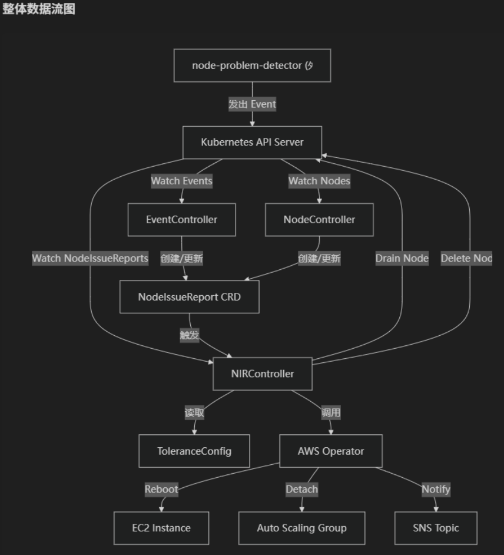
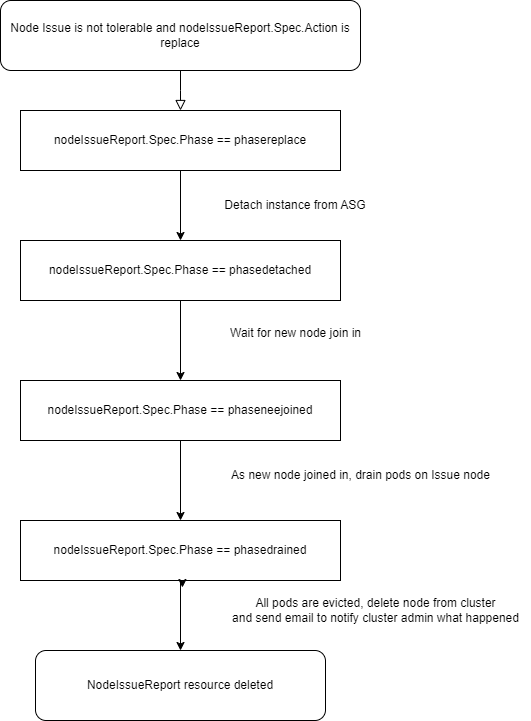
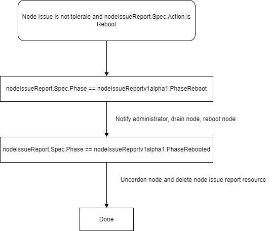

# 简介
npd-node-replace 组件用于缓解当前 Amazon EKS 在中国区未上线的 Auto Repire 导致 EKS 集群中的问题节点无法被及时处理的痛点，仅用于中国区 Amazon EKS，对于 global 区域建议使用 [node auto repair](https://docs.aws.amazon.com/eks/latest/userguide/node-health.html)
npd-node-replace 的主要功能如下：
1. 侦听来自 npd 的关于节点问题的报告事件
2. 将节点的问题事件记录在 NodeIssueReport 中
3. 根据用户配置的 [Tolerance 配置](https://github.com/normalzzz/npd-node-replace/blob/main/pkg/config/tolerance.json) 进行节点的自动替换或重启
4. 通知集群 Admin 节点上发生的历史问题事件
5. 监控节点状态，当节点状态为 NotReady 时，进行节点替换，（节点的替换操作依赖于针对节点的两次状态检查，在节点状态由 Ready 变为 Notready 三分钟之后，会再次检查节点的状态，若节点状态仍为 Notready，则会进行节点替换，若节点状态变为 Ready ，则认为节点正常）
6. 若您仅希望 npd-node-replace 组件对节点问题和状态进行监控，而不进行 reboot 或 replace 操作，可以使用 "npd-node-replace-disabled=true" 标签来对该节点禁用 npd-node-replace 组件的操作。`kubectl label nodes <node name> npd-node-replace-disabled=true` 


## **重要**（使用之前请重点阅读）
- npd-node-replace 组件仅侦听 EKS 托管节点组中节点的事件， 不会处理 Karpenter 节点问题
- npd-node-replace 组件属于个人项目，并不属于 Amazon Web Service 中国区，如果遇到问题请提交 [Issue](https://github.com/normalzzz/npd-node-replace/issues), issue 会被及时处理
- npd-node-replace 组件当前仍处于测试开发阶段，请在详尽的测试和考虑之后使用在 EKS 集群中。
- 推荐将 npd-node-replace 组件部署在 fargate 计算资源上，关于[如何在 EKS 使用 fargate 可以参考文档](https://docs.amazonaws.cn/eks/latest/userguide/fargate-getting-started.html)
- npd-node-replace 组件的 reboot 和 replace 组件都会进行节点 drain 操作，若发现 Pod 驱逐失败的问题，请检查集群中 [PDB 配置](https://kubernetes.io/docs/tasks/run-application/configure-pdb/)，例如 coredns pod 组件存在 PDB 配置若您集群的 coredns pod 都处于同一节点上，推荐使用  "npd-node-replace-disabled=true" 标签来对该节点禁用 npd-node-replace 组件的 replace 和 reboot 操作，
- 关于 coredns pod 的配置，在测试环境中发现了已知问题：
  1. 当 coredns 组件被 PDB 保护（默认 MaxUnavailable=1 ）但是其余节点没有容量调度 Coredns pod，则会造成 coredns pod 的调度失败， reboot 或者 replace 操作之前的 drain 操作会失败，导致整个 reboot 和 replace 流程停滞
  2. 当 coredns 组件均分布于同一节点，同时为了成功驱逐 coredns pod，您手动修改了 coredns PDB 配置，导致 coredns pod 都被驱逐，但是当其余节点都没有容量运行新的 coredns pod 时，会造成集群中的域名解析服务 kube-dns 不可用，导致整个集群的问题。
  3. 故推荐当 coredns pod 都处于同一节点，同时集群中存在资源紧张问题的时候，请使用 "npd-node-replace-disabled=true" 标签为该节点禁用 npd-node-replace 组件，防止集群问题。
- 节点 Reboot 期间，kubelet 无法向 API server 汇报状态，节点状态可能会转变为 NotReady ( API server 参数 --node-monitor-grace-period 配置) ，该节点状态改变会被本组件的 node controller 捕获到，并创建出新的 NodeIssueReport 资源用于记录。如果在超过 grace time， 节点状态 double check 的时候，节点仍未转变为 Ready 状态，则节点会被替换。这种情况是我们不希望的。 
故使用 npd-node-replace 组件之前，需要对节点重启所需的时间进行估计，并通过 values.yaml 中的 nodeDoubleCheckGraceTime 参数进行调整。或直接调整模板 [npd-node-replace-deployment.yaml](https://github.com/normalzzz/npd-node-replace/blob/main/deploy/npd-node-replace-deployment.yaml) 中 Deployment.spec.template.spec.containers 中定义的环境变量 NODE_DOULBE_CHECK_GRACE_TIME 的值（以分钟为单位），如下为示例：

```
        - name: NODE_DOULBE_CHECK_GRACE_TIME
          value: "5"   # the grace time for double check before replacing node, in minutes, default is 3 minutes
```

## 整体架构：


## NodeIssueReport 生命周期：
### Node Replace:



### Node Replace:


## 镜像构建：
您可以使用如下命令进行镜像构建，并将镜像推送到镜像仓库，例如 [Amazon ECR](https://docs.amazonaws.cn/AmazonECR/latest/userguide/docker-push-ecr-image.html) 
```bash
docker build -t npd-node-replace .
```
对于中国区用户，可以使用如下命令：
```bash
docker build -t npd-node-replace -f ./Dockerfile_cn .
```

## Node controller 控制节点生命周期（Action: replace）：
1. 当节点状态从 Ready 转变为 Unknown 或 NotReady 时，会被 Node controller 捕获到节点状态的改变，
2. 为了防止节点抖动造成节点频繁被替换，使用 delayworkqueue 引入 double check 机制，在节点被发现状态转变为 NotReady 或者 Unknown 时候，会首先记录下来，并在 grace time （当前为 3 min）之后，再次检查节点状态，如果节点状态转为 Ready ，则 NotReady 消除记录，认为节点正常， 如果节点状态在第二次检查时，仍然为 NotReady，则对节点替换。
3. 当前已经发现的限制： 如果同一节点在 grace time 之内，状态在 NotReady 和 Ready 状态反复变换，仅会以第一次状态转为 NotReady 的时间作为基准，在 grace time 之后再次检查节点转台，grace time 内由于节点状态转变而反复触发的 Node Update 不会在 grace time 之后再次进行节点状态检查（delayingworkqueue 原生的去重机制）。
4. **重要**：节点 Reboot 期间，kubelet 无法向 API server 汇报状态，节点状态可能会转变为 NotReady ( API server 参数 --node-monitor-grace-period 配置) ，该节点状态改变会被本组件的 node controller 捕获到，并创建出新的 NodeIssueReport 资源用于记录。如果在超过 grace time， 节点状态 double check 的时候，节点仍未转变为 Ready 状态，则节点会被替换。这种情况是我们不希望的。 
故使用 npd-node-replace 组件之前，需要对节点重启所需的时间进行估计，并通过 values.yaml 中的 nodeDoubleCheckGraceTime 参数进行调整。或直接调整模板 [npd-node-replace-deployment.yaml](https://github.com/normalzzz/npd-node-replace/blob/main/deploy/npd-node-replace-deployment.yaml) 中 Deployment.spec.template.spec.containers 中定义的环境变量 NODE_DOULBE_CHECK_GRACE_TIME 的值（以分钟为单位），如下为示例：

```
        - name: NODE_DOULBE_CHECK_GRACE_TIME
          value: "5"   # the grace time for double check before replacing node, in minutes, default is 3 minutes
```

# 部署
**npd-node-place 依赖 node-problem-detector 组件侦听事件，请先部署 [node-problem-detector](https://github.com/kubernetes/node-problem-detector?tab=readme-ov-file#installation)**

## Tolerance 配置：
Tolerance 配置中可以配置对于某些问题发生问题的容忍次数，示例配置：
```json
{
  "tolerancecollection": {
    "OOMKilling": {
      "times": 2,
      "action": "reboot"
    },
    "KernelOops": {
      "times": 3,
      "action": "replace"
    }
  }
}
```
使用该配置，可以实现在触发两次 OOMKill 事件之后重启节点，在触发三次 KernelOops 事件之后，替换节点。
由于事件为 Node Problem Detector 组件发出，关于所有支持的事件类型，可以参考 [Node Problem Detector config](https://github.com/kubernetes/node-problem-detector/tree/master/config)

根据您的 Tolerance 配置需要修改 [tolerance configmap](https://github.com/normalzzz/npd-node-replace/blob/main/deploy/tolerance-configmap.yaml)

### IAM 权限配置：
npd-node-replace 组件需要结合 Amazon EC2、Amazon Autoscaling group 、Amazon SNS 服务，您需要为其配置权限。 
建议通过 [IRSA](https://docs.amazonaws.cn/eks/latest/userguide/iam-roles-for-service-accounts.html) 的方式为 npd-node-replace pod 赋予 Amazon Web Services 权限。
修改 sevice account 配置清单，添加与 IAM role 的关联，如下，您需要将  <irsa iam role arn> 部分替换为 IRSA role arn。
```
apiVersion: v1
kind: ServiceAccount
metadata:
  annotations:
    eks.amazonaws.com/role-arn: <irsa iam role arn>
  creationTimestamp: null
  name: npd-node-replace-sa
  namespace: kube-system
```
IAM role 的权限配置：您可以使用如下 Managed Policy：
[AmazonEC2FullAccess](https://docs.aws.amazon.com/zh_cn/aws-managed-policy/latest/reference/AmazonEC2FullAccess.html)
[AmazonSNSFullAccess](https://docs.aws.amazon.com/zh_cn/aws-managed-policy/latest/reference/AmazonSNSFullAccess.html)
[AutoScalingFullAccess](https://docs.aws.amazon.com/zh_cn/aws-managed-policy/latest/reference/AutoScalingFullAccess.html)

IRSA 的创建方式您可以参考： https://docs.amazonaws.cn/eks/latest/userguide/iam-roles-for-service-accounts.html


### npd-node-replace-deployment.yaml 配置：
#### 环境变量配置：
在 [npd-node-replace-deployment.yaml](https://github.com/normalzzz/npd-node-replace/blob/main/deploy/npd-node-replace-deployment.yaml) 中您需要在 Deployment.spec.template.spec.env 的如下环境变量中添加 SNS Topic ARN:
```yaml
        - name: SNS_TOPIC_ARN
          value: <amazon sns topic arn>
```

#### image url 配置：
需要在如下 Deployment.spec.template.containers["npd-node-replace"].image 部分替换为您之前创建的容器镜像 URL：
```yaml
      containers:
      - image: <image_url>
        name: npd-node-replace
```

### 部署模板：
1. 部署 CRD：
```bash
kubectl apply -f config/crd/nodeissuereporter.xingzhan.io_nodeissuereports.yaml
```
2. 使用 kubectl apply 模板：
```bash
kubectl apply -f deploy/npd-node-replace-clusterrole.yaml
kubectl apply -f deploy/npd-node-replace-clusterrolebinding.yaml
kubectl apply -f deploy/npd-node-replace-sa.yaml
kubectl apply -f deploy/tolerance-configmap.yaml
kubectl apply -f deploy/npd-node-replace-deployment.yaml
```
### Helm 部署
Helm package link : https://github.com/normalzzz/npd-node-replace/blob/main/deploy/npd-node-replace/npd-node-replace-0.1.0.tgz
1. values.yaml 参数配置文件修改：
```yaml
kubernetesClusterDomain: cluster.local
npdNodeReplace:
  npdNodeReplace:
    env:
      snsTopicArn: <sns topic arn>
    image:
      repository: zxxxxzz/npd-node-replace
      tag: v1
    imagePullPolicy: Always
  replicas: 1
sa:
  serviceAccount:
    annotations:
      eks.amazonaws.com/role-arn: <IRSA IAM role arn>
toleranceConfig:
  toleranceJson: |-
    {
      "tolerancecollection": {
        "OOMKilling": {
          "times": 2,
          "action": "reboot"
        },
        "KernelOops": {
          "times": 3,
          "action": "replace"
        }
      }
    }

```
- <sns topic arn> 修改为 EKS 集群账户中存在的 Amazon SNS Topic ARN
- npdNodeReplace.npdNodeReplace.image 中的 zxxxxzz/npd-node-replace:v1 镜像存在于 Docker 官方，如果在中国大陆遇到镜像无法拉取的问题，请将镜像转移到 Amazon ECR 并将该字段替换为 Amazon ECR 镜像 URL，详细操作步骤可以参考 [Amazon ECR 官方文档](https://docs.amazonaws.cn/AmazonECR/latest/userguide/docker-push-ecr-image.html)
- sa.serviceAccount.annotations 中 <IRSA IAM role arn> 请替换为 [IAM 权限配置](https://github.com/normalzzz/npd-node-replace?tab=readme-ov-file#iam-%E6%9D%83%E9%99%90%E9%85%8D%E7%BD%AE) 部分创建的 Amazon IAM Role ARN **通过 Helm chart 创建的 service account 所处的命名空间(namespace) 以及 service account name 会与您 helm install 时传入的 release name 和 namespace 参数相关，请检查 Amazon IAM role 的信任实体中的 service account 信息与您当前集群中的 service account 信息一致**
- toleranceConfig 部分请根据业务需求修改，参考[Tolerance 配置](https://github.com/normalzzz/npd-node-replace?tab=readme-ov-file#tolerance-%E9%85%8D%E7%BD%AE)部分

2. 安装 release：
`helm install <release_name> <Helm Chart Path> -n <namespace> -f values.yaml`
或 
`helm install <my-release> oci://registry-1.docker.io/zxxxxzz/npd-node-replace --version 0.1.0`

3. 卸载 release：
`helm uninstall <release name> -n <namespace>`

# 测试：
可以使用如下方式注入实例系统问题：
OOMKilling 问题模拟：
```bash
echo "Killed process 1234 (myapp) total-vm:102400kB, anon-rss:51200kB, file-rss:2048kB" | sudo tee /dev/kmsg
```

KernelOops 问题模拟：
```bash
echo "<1>BUG: unable to handle kernel NULL pointer dereference at 0x00000000" | sudo tee /dev/kmsg
echo "<1>divide error: 0000 [#1] SMP" | sudo tee /dev/kmsg
```

根据仓库中的[示例配置](https://github.com/normalzzz/npd-node-replace/blob/main/deploy/tolerance-configmap.yaml)，在使用上述方式触发两次 OOMKilling 事件之后，会发生节点重启。 触发三次 KernelOops 事件之后，会发生节点替换。且在节点重启和替换之后，在 [npd-node-replace-deployment.yaml](https://github.com/normalzzz/npd-node-replace/blob/main/deploy/npd-node-replace-deployment.yaml) 中配置的 SNS topic 会受到邮件提醒，通知节点发生过的历史问题。


# npd-node-replace 资源消耗评估：
```bash
[root@Test ~]# kubectl top pod npd-node-replace-5c67496ffd-gkg2w -n kube-system
NAME                                CPU(cores)   MEMORY(bytes)   
npd-node-replace-5c67496ffd-gkg2w   1m           7Mi     
```

# TODOS:
1. 处理节点 NotReady 状态 <-- DONE 需要测试
2. 通过节点 label 对节点做黑名单，发现问题时仅发送邮件通知管理员，但是不将节点移除集群。<-- DONE 需要测试。
3. drain 节点时引入重试机制  <-- DONE, 需要测试
4. 加入对节点 grace time 的支持 <-- DONE 需要测试
5. 添加 NIR 资源的阈值处理（超过触发告警，发送邮件）
6. 细分处理节点 unknown 和notready 状态
```go
const (
	ConditionTrue    ConditionStatus = "True"
	ConditionFalse   ConditionStatus = "False"
	ConditionUnknown ConditionStatus = "Unknown"
)
```